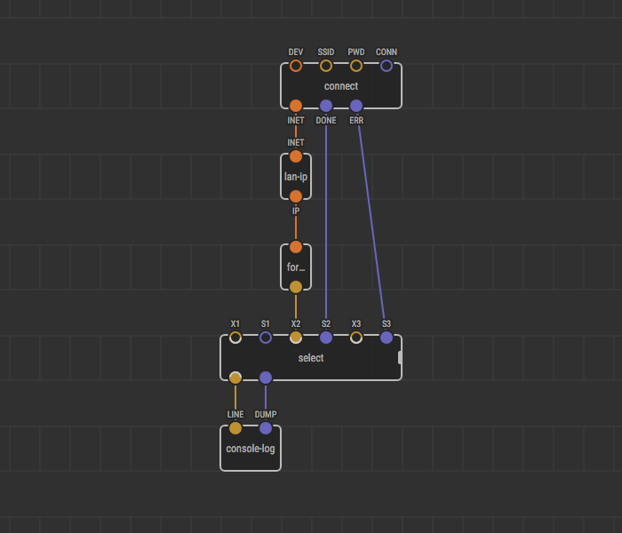

# Connecting to Internet With ESP8266-based MCUs

ESP8266-based boards such as NodeMCU and WeMos D1 Mini are quite popular for projects that require internet connection because of their built-in WiFi capabilities. 

XOD provides [`xod-dev/esp8266-mcu`](https://xod.io/libs/xod-dev/esp8266-mcu/) library that makes connecting to the internet very simple. All you need is a [`connect`](https://xod.io/libs/xod-dev/esp8266-mcu/connect/) node:

Bind your network SSID and password to `SSID` and `PWD` pins and you are good to go. Link `INET` to nodes that need an established
internet connection (for example, to [make HTTP requests](../http-get/)).

## Checking the Connection

Let's build a small patch to verify that connection is successful.
First, it will print "Connecting" to the debugger, then (after a little delay) your local IP if connection was successful or "Error" if something went wrong.

The
[`xod-dev/esp8266-mcu/lan-ip`](https://xod.io/libs/xod-dev/esp8266-mcu/lan-ip/) gets
the IP address from `INET` and
[`xod/net/format-ip`](https://xod.io/libs/xod/net/format-ip/) 
formats the IP as a human-readable string like “192.168.88.101”.

To output the progress to the debugger we use `select` and `console-log`. Bind `"Connecting"` to `select`'s `X1`, `On Boot` to `S1` and `"Error"` to `X3`. 

Upload the patch to your board in debug mode. You should see something like this:

